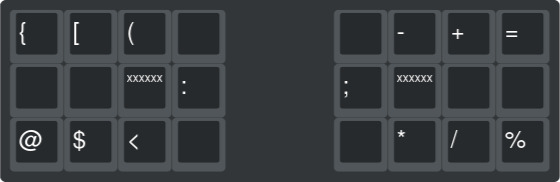
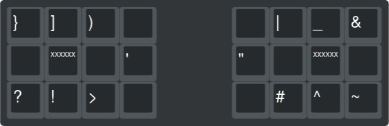

#+Title: Technonomicon README

* WARNING:

I am not a programmer. I can offer no promises as to the safety, or efficiency of these configuration settings.

* Technonomicon

This repository holds all the configuration settings for my personal computers, organized as a Nix Flake. While not "/done/". I would consider most of what's there stable, and in working condition. I built this to learn more about computer science, Linux, and to eventually learn to program. It is currently divided into four major groups.

- Flakes: This directory holds all the files needed for flakes specific functions.
- Shared: This directory holds application specific files, used by Home-manager. They are grouped together by use-case. So they can be shared by machine specific configurations.
- Thanatos: This directory holds all the files to configure NixOS for my work computer.
- Artemis: This directory holds all the files to configure NixOS for my living room media center computer.

* Key Combos
This configuration uses a custom layout for the ZSA Moonlander.

*** Modifier Combos

- Alt =R-S=
- Alt Greater =I-E=
- Left Shift =P-F=
- Right Shift =L-U=
- Left Ctrl =F-W=
- Right Ctrl =U-Y=
- Left Super =D-C=
- Right Super =,-.=

*** System Combos
- Home =F-S=
- End =S-D=
- =T-V=
- =R-C=
- Esc =H-,=
- ESC + Shift =H-,-V-D=
- Tab =V-D=
- Backspace + Ctrl =P-T=
- Delete + Ctrl =W-R=
- Enter =T-S=
- Space =N-E=

*** Arrow Combos
- Up =U-E=
- Down =E-,=
- Left =N-H=
- Right =I-.=
- Right + Ctrl =Y-I=
- Left + Ctrl =L-N=

*** Symbol Combos
- ( =N-P=
- [ =N-F=
- { =N-W=
- < =N-V=
- $ =N-D=
- @ =N-C=
- : =N-G=

- ) =E-P=
- ] =E-F=
- } =E-W=
- > =E-V=
- ! =E-D=
- ? =E-C=
- ' =E-G=

- - =T-L=
- + =T-U=
- = =T-Y=
- * =T-H=
- / =T-,=
- % =T-.=
- ; =T-M=

- | =S-l=
- _ =S-U=
- & =S-Y=
- # =S-H=
- ^ =S-,=
- ~ =S-.=
- " =S-M=
